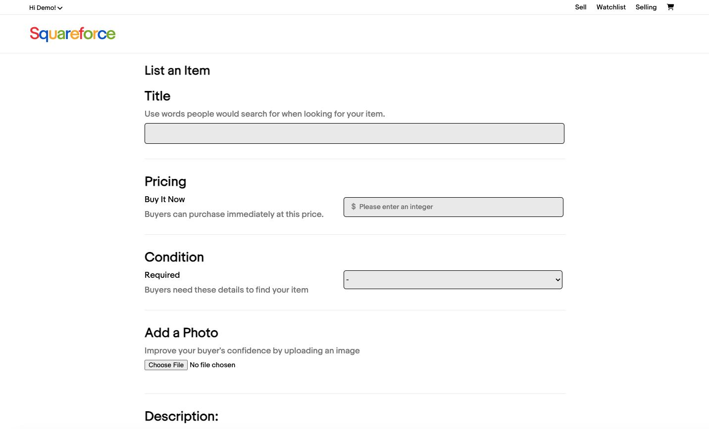
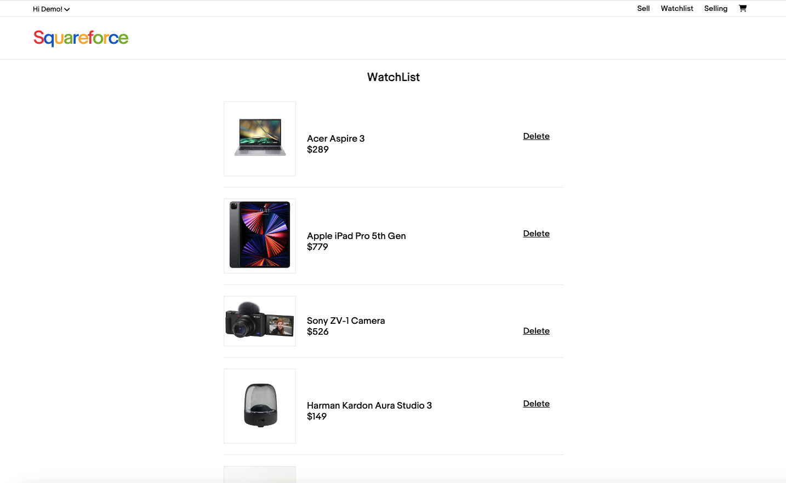
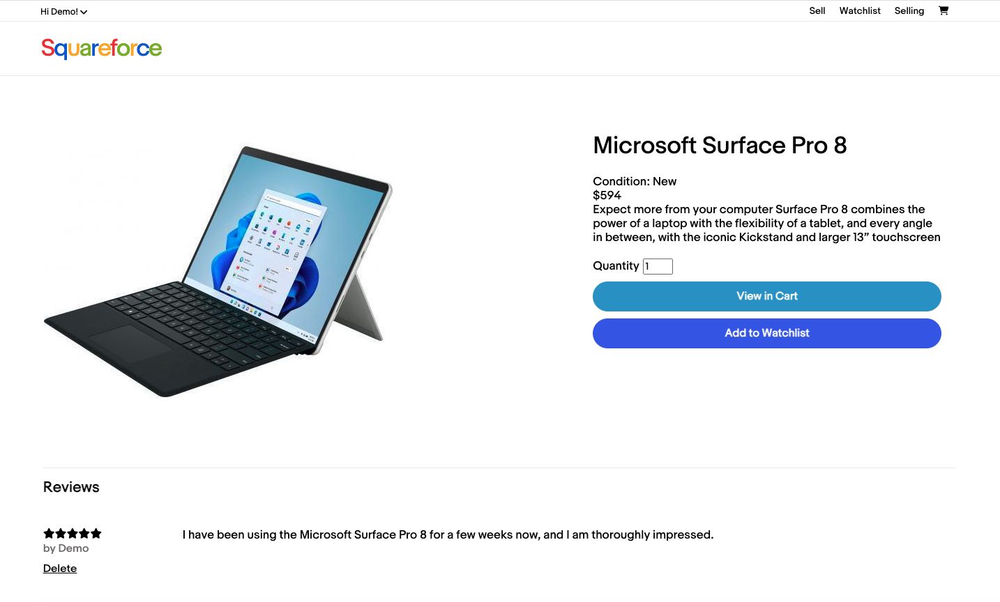
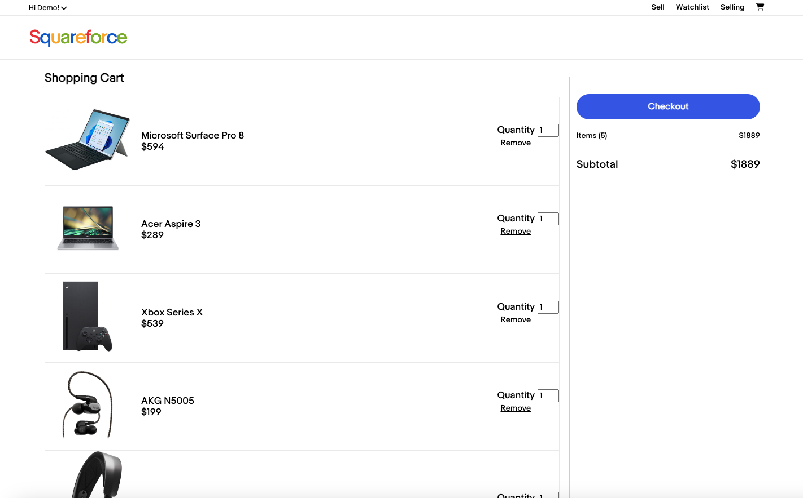

# SquareForce
### Link to live site:
https://james-squareforce.onrender.com


### Index
[Feature List](https://github.com/howtojames/SquareForce/wiki/Feature-List) |
[Database Scheme](https://github.com/howtojames/SquareForce/wiki/Database-Schema-and-Backend-Routes) |
[User Stories](https://github.com/howtojames/SquareForce/wiki/User-Stories)


### Technologies Used
Javascript, React, Redux, Python, Flask, SQLALchemy, PostgreSQL, Render, HTML, CSS, AWS S3


### Summary:
Welcome to SquareForce, your premier destination for buying and selling goods online! At SquareForce, we pride ourselves on providing a seamless and secure platform for users to buy, sell, and discover a wide array of products. Whether you're hunting for laptops, computer, or even game consoles, SquareForce has you covered.


## ScreenShots:
### Landing Page


### List an Item


### Watchlist


### Product Details


### Shopping Cart



## Getting started
1. To clone the project:
```
git clone git@github.com:howtojames/SquareForce.git
```
2. Create an .env file in the Codera folder. Copy `.env.example` file into the `.env file.`

3. To install dependencies and seed the database, `cd` into the `Codera` folder:
```
pipenv install
pipenv install -r requirements.txt
```

4. To seed the database:
```
pipenv run flask db init
pipenv run flask db migrate
pipenv run flask db upgrade
pipenv run flask seed all
```

5. To start the backend, run:
```
pipenv run flask run
```

6. Split into a different terminal, and `cd` into the `react-vite` folder. Run `npm run dev` to start the frontend.
```
npm install
npm run dev
```

7. In your browser, navigate to [`localhost:5173`].


## Features
### 1. User signup, login, log out, demo user
* Users can sign up, log in, and log out
* Users can login with a demo user

### 2. Products
* Both users and non-users can see a list of products on the main page.
* Both users and non-users can see a product details page.
* For logged-in users, they create, update and delete a product listing.

### 3. Shopping Cart
* Users can add and delete a product in their shopping cart.
* Users can update the product quantity in their shopping cart.

### 4. Reviews
* Users that purchased an product can post, edit and delete their review on that product.

### 5. Watchlist
* Users can post, edit and delete their a product on their watchlist.


## Connect
* James Ruan [Github](https://github.com/howtojames) [LinkedIn](https://www.linkedin.com/in/james-ruan-03b95b104/)
